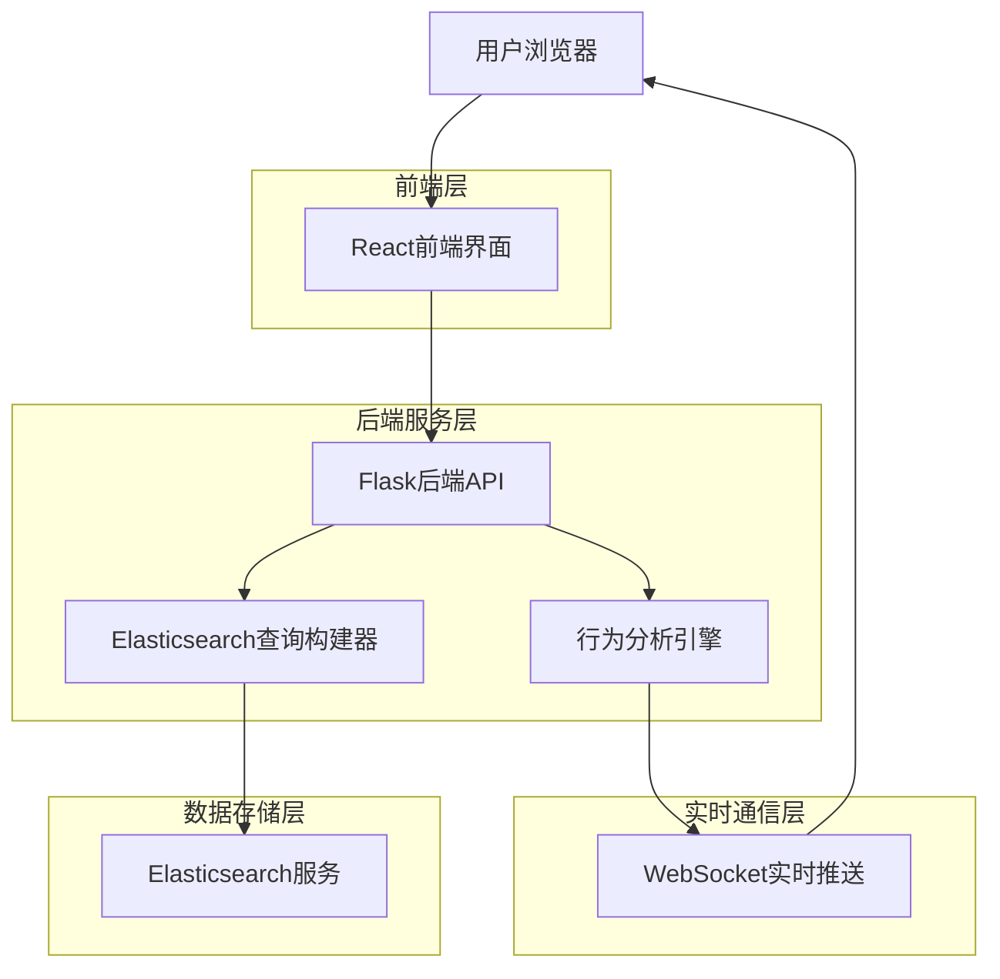

# Elasticsearch 日志搜索集成技术架构

## 1. 架构概述

本架构设计旨在为实时日志收集器添加Elasticsearch日志搜索功能，支持通过Web界面输入index_name、UserId和时间范围进行全量日志搜索，并应用现有的行为解析逻辑进行分析。

### 1.1 架构图



## 2. 前端界面设计

### 2.1 搜索界面组件

新增Elasticsearch搜索模式，在现有控制面板中添加：

```html
<div class="control-section">
    <h3>Elasticsearch搜索</h3>
    <div class="es-search-form">
        <div class="form-group">
            <label>索引名称:</label>
            <input type="text" id="es-index-name" placeholder="输入Elasticsearch索引名">
        </div>
        <div class="form-group">
            <label>用户ID:</label>
            <input type="text" id="es-user-id" placeholder="输入用户ID">
        </div>
        <div class="form-group">
            <label>开始时间:</label>
            <input type="datetime-local" id="es-start-time">
        </div>
        <div class="form-group">
            <label>结束时间:</label>
            <input type="datetime-local" id="es-end-time">
        </div>
        <div class="form-group">
            <button id="es-search-btn">搜索日志</button>
            <button id="es-search-stop" style="display:none;">停止搜索</button>
        </div>
    </div>
</div>
```

### 2.2 搜索结果展示

搜索结果将在现有日志容器中显示，使用不同的样式区分Elasticsearch结果：

```javascript
// 添加Elasticsearch搜索结果处理
socket.on('es_search_result', function(data) {
    const logContainer = document.getElementById('log-container');
    const entry = document.createElement('div');
    entry.className = 'log-entry es-result';
    entry.innerHTML = `
        <span class="timestamp">${data.timestamp}</span>
        <span class="platform">[ES]</span>
        <span class="message">${data.message}</span>
    `;
    logContainer.appendChild(entry);
    logContainer.scrollTop = logContainer.scrollHeight;
});
```

## 3. 后端API设计

### 3.1 搜索接口

新增Elasticsearch搜索API端点：

```python
@app.route('/api/es/search', methods=['POST'])
def es_search():
    """
    Elasticsearch日志搜索接口
    
    请求体:
        {
            'index_name': str,      # 索引名称
            'user_id': str,         # 用户ID
            'start_time': str,      # 开始时间 (ISO格式)
            'end_time': str,        # 结束时间 (ISO格式)
            'platform': str         # 平台类型
        }
    
    返回:
        {
            'success': bool,        # 搜索是否成功
            'total_hits': int,       # 总命中数
            'processed': int,      # 已处理数量
            'message': str           # 状态消息
        }
    """
    pass
```

### 3.2 搜索状态接口

```python
@app.route('/api/es/search/status', methods=['GET'])
def es_search_status():
    """
    获取Elasticsearch搜索状态
    
    返回:
        {
            'searching': bool,     # 是否正在搜索
            'progress': float,     # 搜索进度 (0-1)
            'processed': int,       # 已处理数量
            'total': int            # 总数
        }
    """
    pass
```

## 4. Elasticsearch查询构建逻辑

### 4.1 查询构建器扩展

扩展现有的`ESQueryBuilder`类，添加用户ID和时间范围查询：

```python
class ESLogQueryBuilder(ESQueryBuilder):
    def build_user_time_range_query(self, index_name, user_id, start_time, end_time):
        """构建基于用户ID和时间范围的查询"""
        base_query = {
            "query": {
                "bool": {
                    "must": [
                        {"term": {"userId": user_id}},
                        {"range": {"@timestamp": {"gte": start_time, "lte": end_time}}}
                    ]
                }
            },
            "sort": [{"@timestamp": {"order": "asc"}}],
            "size": 1000
        }
        return base_query
    
    def build_scroll_query(self, scroll_id=None):
        """构建滚动查询用于处理大量数据"""
        if scroll_id:
            return {
                "scroll": "2m",
                "scroll_id": scroll_id
            }
        return None
```

### 4.2 搜索服务类

创建专门的Elasticsearch搜索服务：

```python
class ElasticsearchSearchService:
    def __init__(self, env='sandbox'):
        self.es_util = EsUtil(env=env)
        self.query_builder = ESLogQueryBuilder('config/es_search_config.yaml')
        self.search_active = False
        self.search_progress = 0
        self.processed_count = 0
        self.total_hits = 0
    
    def search_logs(self, index_name, user_id, start_time, end_time, platform):
        """执行Elasticsearch日志搜索"""
        self.search_active = True
        self.search_progress = 0
        self.processed_count = 0
        
        try:
            # 构建查询
            query = self.query_builder.build_user_time_range_query(
                index_name, user_id, start_time, end_time
            )
            
            # 执行搜索
            results = self.es_util.search(query, index_name)
            self.total_hits = len(results)
            
            # 处理结果
            for hit in results:
                if not self.search_active:
                    break
                
                # 提取日志内容
                log_data = self._extract_log_data(hit)
                
                # 应用行为分析
                self._analyze_log_with_behavior(log_data, platform)
                
                # 更新进度
                self.processed_count += 1
                self.search_progress = self.processed_count / self.total_hits
                
                # 发送实时更新
                socketio.emit('es_search_progress', {
                    'processed': self.processed_count,
                    'total': self.total_hits,
                    'progress': self.search_progress
                })
            
            return {
                'success': True,
                'total_hits': self.total_hits,
                'processed': self.processed_count,
                'message': f'搜索完成，处理了 {self.processed_count} 条日志'
            }
            
        except Exception as e:
            return {
                'success': False,
                'total_hits': 0,
                'processed': self.processed_count,
                'message': f'搜索失败: {str(e)}'
            }
        finally:
            self.search_active = False
    
    def stop_search(self):
        """停止搜索"""
        self.search_active = False
    
    def _extract_log_data(self, hit):
        """从Elasticsearch结果中提取日志数据"""
        source = hit.get('_source', {})
        return {
            'timestamp': source.get('@timestamp', ''),
            'message': source.get('message', ''),
            'userId': source.get('userId', ''),
            'level': source.get('level', 'INFO'),
            'module': source.get('module', ''),
            'raw_data': json.dumps(source)
        }
    
    def _analyze_log_with_behavior(self, log_data, platform):
        """使用现有行为分析逻辑处理日志"""
        # 调用现有的analyze_log_behavior函数
        analyze_log_behavior(log_data['raw_data'], platform)
        
        # 发送处理结果到前端
        socketio.emit('es_search_result', {
            'timestamp': log_data['timestamp'],
            'platform': platform,
            'message': log_data['message'],
            'userId': log_data['userId'],
            'level': log_data['level']
        })
```

## 5. 行为解析集成方案

### 5.1 集成现有分析逻辑

Elasticsearch搜索结果将复用现有的行为分析引擎：

```python
def analyze_log_behavior(log_line, platform='elasticsearch'):
    """
    分析日志行为（扩展版本，支持Elasticsearch数据）
    
    参数:
        log_line: 日志行内容
        platform: 平台类型（默认为elasticsearch）
    """
    # 原有的行为分析逻辑保持不变
    # ... 现有代码 ...
    
    # 可以添加Elasticsearch特定的处理逻辑
    if platform == 'elasticsearch':
        # 处理Elasticsearch格式的日志数据
        pass
```

### 5.2 数据格式适配

确保Elasticsearch数据格式与现有分析逻辑兼容：

```python
def adapt_es_data_to_behavior_format(es_data):
    """
    将Elasticsearch数据格式适配为行为分析所需的格式
    
    参数:
        es_data: Elasticsearch原始数据
    
    返回:
        dict: 适配后的数据格式
    """
    return {
        'platform': 'elasticsearch',
        'timestamp': es_data.get('@timestamp'),
        'level': es_data.get('level', 'INFO'),
        'tag': es_data.get('module', ''),
        'message': es_data.get('message', ''),
        'raw': json.dumps(es_data)
    }
```

## 6. 配置管理方案

### 6.1 Elasticsearch搜索配置

创建专门的Elasticsearch搜索配置文件：

```yaml
# config/es_search_config.yaml
index_name: "app-logs-*"
query_config:
  rules:
    - range
    - term
  params:
    range:
      field: "@timestamp"
      gte: "{{start_time}}"
      lte: "{{end_time}}"
    term:
      field: "userId"
      value: "{{user_id}}"
  source_fields:
    - "@timestamp"
    - "message"
    - "userId"
    - "level"
    - "module"
    - "properties"
  size: 1000
  sort:
    - "@timestamp": "asc"
```

### 6.2 环境配置扩展

在现有环境配置中添加Elasticsearch搜索相关配置：

```yaml
# config/local_config.yaml
es_config:
  sandbox:
    host: 'search-skyeye-sandbox-dnmtmyvnwoymamlv4dg23hmvg4.us-west-2.es.amazonaws.com'
    region: 'us-west-2'
    search.max_open_scroll_context: 500
    # 新增搜索配置
    search.timeout: 60
    search.batch_size: 1000
    search.max_results: 10000
```

## 7. 前端JavaScript集成

### 7.1 搜索功能实现

```javascript
// 添加Elasticsearch搜索功能
class ElasticsearchSearch {
    constructor() {
        this.searching = false;
        this.socket = io();
        this.initializeEventListeners();
        this.initializeSocketHandlers();
    }
    
    initializeEventListeners() {
        document.getElementById('es-search-btn').addEventListener('click', () => {
            this.startSearch();
        });
        
        document.getElementById('es-search-stop').addEventListener('click', () => {
            this.stopSearch();
        });
    }
    
    initializeSocketHandlers() {
        this.socket.on('es_search_progress', (data) => {
            this.updateProgress(data);
        });
        
        this.socket.on('es_search_result', (data) => {
            this.displayResult(data);
        });
    }
    
    async startSearch() {
        const indexName = document.getElementById('es-index-name').value;
        const userId = document.getElementById('es-user-id').value;
        const startTime = document.getElementById('es-start-time').value;
        const endTime = document.getElementById('es-end-time').value;
        
        if (!indexName || !userId || !startTime || !endTime) {
            alert('请填写所有必填字段');
            return;
        }
        
        this.searching = true;
        this.toggleSearchButtons();
        
        try {
            const response = await fetch('/api/es/search', {
                method: 'POST',
                headers: {
                    'Content-Type': 'application/json',
                },
                body: JSON.stringify({
                    index_name: indexName,
                    user_id: userId,
                    start_time: startTime,
                    end_time: endTime,
                    platform: 'elasticsearch'
                })
            });
            
            const result = await response.json();
            
            if (result.success) {
                this.showMessage(`搜索完成: ${result.message}`);
            } else {
                this.showMessage(`搜索失败: ${result.message}`, 'error');
            }
        } catch (error) {
            this.showMessage(`搜索请求失败: ${error.message}`, 'error');
        } finally {
            this.searching = false;
            this.toggleSearchButtons();
        }
    }
    
    async stopSearch() {
        try {
            await fetch('/api/es/search/stop', {
                method: 'POST'
            });
            this.showMessage('搜索已停止');
        } catch (error) {
            this.showMessage(`停止搜索失败: ${error.message}`, 'error');
        }
    }
    
    toggleSearchButtons() {
        const searchBtn = document.getElementById('es-search-btn');
        const stopBtn = document.getElementById('es-search-stop');
        
        if (this.searching) {
            searchBtn.style.display = 'none';
            stopBtn.style.display = 'inline-block';
        } else {
            searchBtn.style.display = 'inline-block';
            stopBtn.style.display = 'none';
        }
    }
    
    updateProgress(data) {
        const progress = Math.round(data.progress * 100);
        this.showMessage(`搜索进度: ${progress}% (${data.processed}/${data.total})`);
    }
    
    displayResult(data) {
        // 结果将通过现有的日志系统显示
        console.log('ES Search Result:', data);
    }
    
    showMessage(message, type = 'info') {
        // 使用现有的消息显示机制
        console.log(`[ES Search] ${message}`);
    }
}

// 初始化Elasticsearch搜索功能
document.addEventListener('DOMContentLoaded', () => {
    new ElasticsearchSearch();
});
```

## 8. 错误处理和监控

### 8.1 错误处理

```python
class ElasticsearchSearchService:
    def search_logs(self, index_name, user_id, start_time, end_time, platform):
        try:
            # ... 搜索逻辑 ...
            pass
        except ConnectionError as e:
            logging.error(f"Elasticsearch连接失败: {e}")
            return {'success': False, 'message': '无法连接到Elasticsearch服务'}
        except Exception as e:
            logging.error(f"搜索过程发生错误: {e}")
            return {'success': False, 'message': f'搜索失败: {str(e)}'}
```

### 8.2 性能监控

```python
def monitor_search_performance():
    """监控搜索性能指标"""
    metrics = {
        'search_duration': 0,
        'results_per_second': 0,
        'total_results_processed': 0,
        'error_rate': 0
    }
    
    # 记录性能指标
    logging.info(f"搜索性能指标: {json.dumps(metrics)}")
    
    # 发送性能数据到前端
    socketio.emit('es_search_metrics', metrics)
```

## 9. 部署和配置

### 9.1 环境要求

- Python 3.7+
- Elasticsearch 7.x+
- Flask 2.0+
- 相关Python包：opensearch-py, boto3, pytz

### 9.2 配置文件更新

更新现有的配置文件，添加Elasticsearch搜索相关配置：

```yaml
# config.yaml
elasticsearch_search:
  enabled: true
  default_env: sandbox
  max_results: 10000
  batch_size: 1000
  timeout: 60
  
# 现有的行为配置保持不变
behaviors:
  # ... 现有配置 ...
```

### 9.3 启动参数

支持通过环境变量控制Elasticsearch搜索功能：

```bash
# 启用Elasticsearch搜索
export ES_SEARCH_ENABLED=true

# 设置默认环境
export ES_DEFAULT_ENV=sandbox

# 启动服务器
python server.py
```

## 10. 安全考虑

### 10.1 认证和授权

- 使用AWS IAM认证访问Elasticsearch
- 实施API访问频率限制
- 记录所有搜索操作日志

### 10.2 数据保护

- 敏感数据脱敏处理
- 搜索参数验证和清理
- HTTPS通信加密

### 10.3 性能保护

- 搜索结果数量限制
- 搜索超时设置
- 资源使用监控

这个技术架构提供了一个完整的Elasticsearch日志搜索集成方案，既保持了与现有系统的兼容性，又提供了强大的搜索和分析功能。